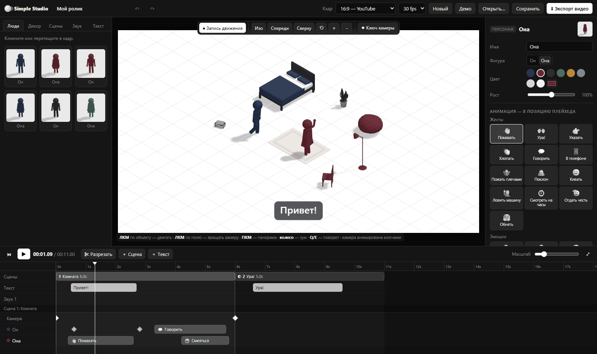
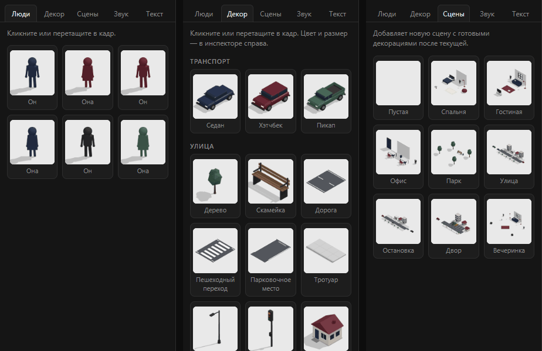
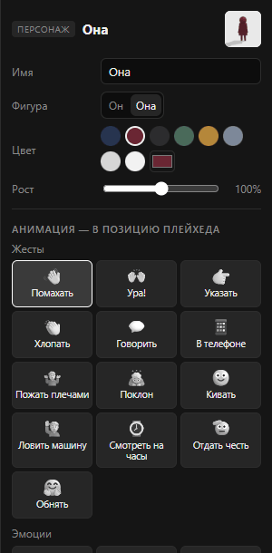
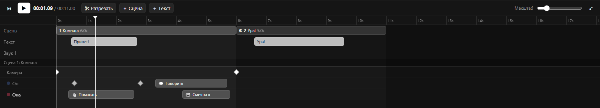
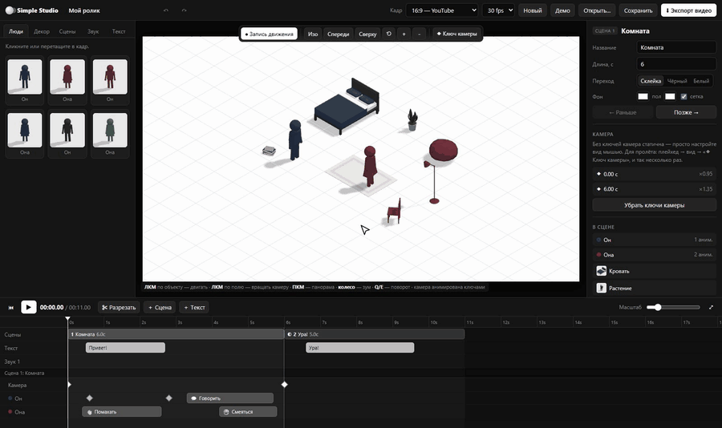
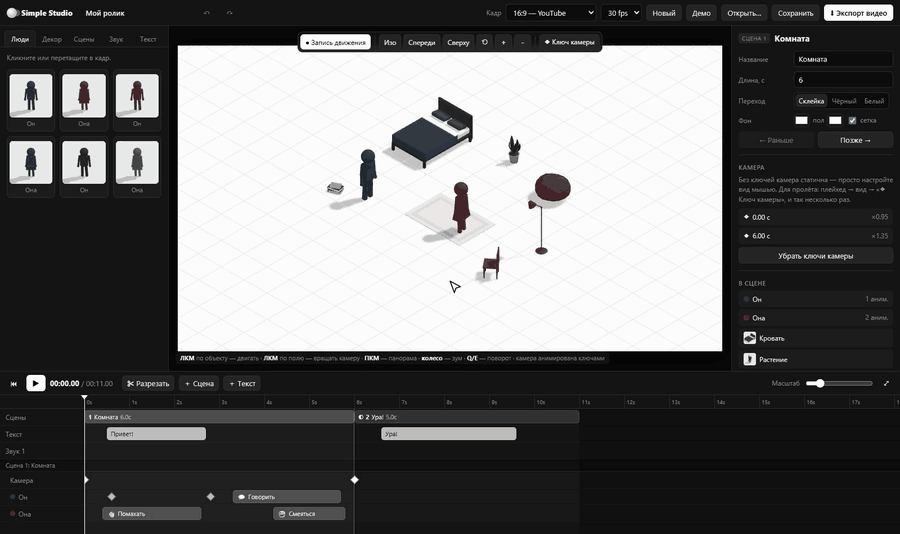
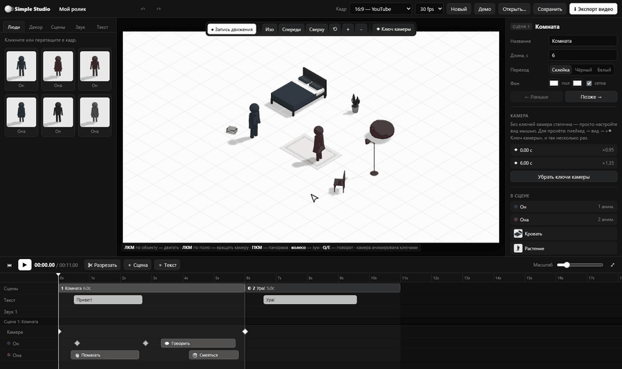
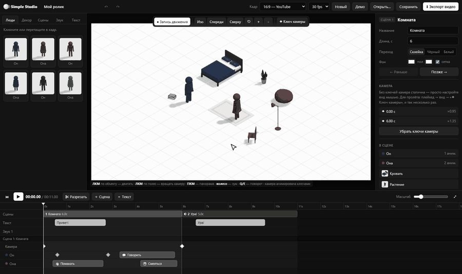
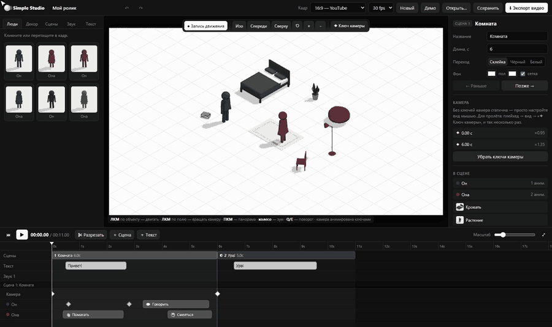
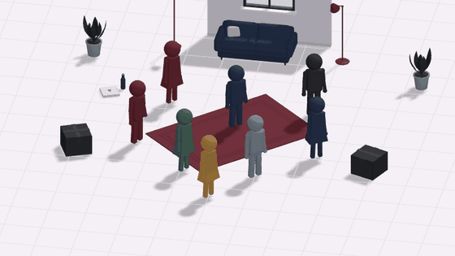

# Simple Studio

Браузерная студия для мини-роликов с минималистичными изометрическими человечками.
Собираете сцены из персонажей и декораций, задаёте анимации и движение, двигаете камеру,
кладёте музыку и титры — и экспортируете готовое видео в MP4. Стиль — референсы в `reference/`.



## Возможности

- **Сцены** идут подряд на таймлайне, как клипы в CapCut: длительность, порядок, переходы (склейка / через чёрный / через белый).
  Готовые шаблоны: «Спальня», «Гостиная», «Офис», «Парк», большие уличные «Улица», «Остановка», «Двор» и «Вечеринка».
- **Персонажи** — «он» / «она», любой цвет, рост. **37 анимаций**: жесты, эмоции, танцы, прыжки, позы (сидеть, лежать, на колено…).
- **Движение** — режим «● Запись движения»: ставите плейхед, тащите персонажа — он сам идёт/бежит по точкам и поворачивается по ходу.
- **Декорации** — интерьер, улица (дорога, переход, парковка, фонари, светофор, дома, магазин, остановка…) и **транспорт**:
  седан, хэтчбек, пикап. Машины ездят по ключам с разгоном и торможением, колёса крутятся.
- **Камера** — по умолчанию изометрия; вращение, панорама, зум мышью; ключи камеры для пролётов.
- **Как в CapCut**: «＋ Пустой кадр» без 3D, свои **фото и видео** поверх любого кадра (двигать и масштабировать мышью, обрезка и звук видео),
  **стикеры** (эмодзи и фигуры с анимациями), **фильтры** на фрагмент или всё видео (Ч/Б, нуар, винтаж, тепло, холод, плёнка, виньетка…).
- **Текст** — окно редактирования: 14 шрифтов с кириллицей, жирный/курсив, выравнивание, обводка, подложка, тень, интервал,
  анимации появления (проявление, выпрыгивание, выезд, печатная машинка), свободная позиция мышью; **звук** — несколько дорожек, обрезка, громкость, фейды, волна.
- **Дорожки как в CapCut**: текст, стикеры, фото и видео лежат на слоях — верхний слой поверх в кадре. Наложили клип на другой —
  таймлайн подсветит «＋ новая дорожка» и создаст её; пустые дорожки исчезают сами. Скрыть слой / выключить звук — в заголовке дорожки,
  «Слой выше/ниже» — Ctrl+] / Ctrl+[, копировать/вставить клип — Ctrl+C / Ctrl+V, привязка к краям клипов с линией магнита.
- **Таймлайн** показывает анимации всех сцен сразу; клипы не выходят за свою сцену, а плейхед магнитно цепляется за границу сцены выбранного объекта.
- **Экспорт** — покадровый рендер в MP4 (H.264 + AAC), 720p–1440p, 16:9 / 9:16 / 1:1 / 4:3,
  для вертикального видео — «квадрат» с плашками под заголовок и субтитры.
- Undo/redo, автосохранение в браузере, сохранение проекта в файл (`.studio.json`, звук внутри).

## Программа для Windows

Готовый файл — **`Simple Studio.exe`** (портативный, без установки): просто запустите его.
Проекты, звук, фото и видео хранятся в профиле приложения и сохраняются автоматически;
при запуске открывается меню проектов (создать, шаблоны, открыть, переименовать, дублировать, удалить).

Собрать `.exe` самому: `npm run exe` → `release/Simple Studio.exe`.

## Запуск из исходников

```bash
npm install
npm run dev      # http://localhost:5173
npm run build    # статическая сборка в dist/
```

Нужен Chrome или Edge (WebCodecs). В других браузерах экспорт уходит в WebM в реальном времени.

## Интерфейс

| Библиотека: люди, декор, шаблоны сцен | Инспектор выбранного объекта |
| --- | --- |
|  |  |

- **Слева — библиотека.** Кликните по элементу или перетащите его в кадр. Ширину панели можно менять, потянув за правый край.
- **В центре — кадр.** ЛКМ по объекту — двигать, ЛКМ по пустому месту — вращать камеру, ПКМ — панорама, колесо — зум, Q/E — поворот объекта.
- **Справа — инспектор.** Свойства того, что выбрано: цвет, размер, анимации персонажа, поездка машины, настройки сцены и камеры.
- **Снизу — таймлайн.** Сверху общие дорожки (сцены, текст, звук), ниже — детали текущей сцены: камера, анимации персонажей, ключи движения и поездок.



## Как сделать ролик

### 1. Добавьте сцену

Вкладка **«Сцены»** → кликните шаблон — сцена встанет на таймлайн после текущей. «Пустая» — чистый лист.
Длину сцены меняйте за правый край клипа на таймлайне, порядок — перетаскиванием, переход — в инспекторе сцены.



### 2. Персонажи и анимации

Вкладка **«Люди»** → кликните фигурку, она появится в кадре. В инспекторе нажмите жест или позу —
анимация ляжет на дорожку персонажа **с позиции плейхеда**. Переставьте плейхед и добавьте следующую.
Клипы анимаций на таймлайне можно двигать, растягивать за края и резать клавишей **S**.



### 3. Движение по сцене

Включите **«● Запись движения»** (кнопка над кадром). Поставьте плейхед на момент, к которому персонаж должен прийти,
и перетащите его в новую точку — появится ключ. Между ключами он сам пойдёт (или побежит, если быстро) и развернётся по ходу.
Пунктир в кадре — его путь, ромбики на таймлайне — ключи.



### 4. Машины

Вкладка **«Декор» → «Транспорт»**. Машины записываются так же, как люди: плейхед → перетащить.
Между ключами машина разгоняется, тормозит, поворачивает по ходу, колёса крутятся.
Ключи поездки видны в инспекторе («Поездка») и на отдельной дорожке таймлайна.



### 5. Камера, звук, текст

- Настройте вид мышью — без ключей камера просто стоит. Для пролёта: плейхед → вид → **«◆ Ключ камеры»**, и так несколько раз.
- Вкладка **«Звук»** → «Загрузить аудио»: клип встанет с позиции плейхеда, его можно двигать, обрезать за края, делать фейды.
- **«＋ Текст»** на таймлайне — субтитр или заголовок; стиль, позиция и размер — в инспекторе.

### 6. Экспорт

**«⬇ Экспорт видео»** → качество → «Начать рендер». Видео рендерится покадрово, поэтому не теряет кадры даже на слабом компьютере,
и скачивается в MP4. Формат кадра (16:9, 9:16 для Shorts/Reels, 1:1, 4:3) и fps — в верхней панели.



## Горячие клавиши

| Клавиша | Действие |
| --- | --- |
| Пробел | play / pause |
| S | разрезать выбранный клип по плейхеду |
| Q / E | повернуть выбранный объект |
| Ctrl+D | дублировать |
| Del | удалить |
| Ctrl+Z / Ctrl+Y | отмена / повтор |
| ← / → | на кадр назад / вперёд (с Shift — на секунду) |
| Ctrl + колесо на таймлайне | масштаб таймлайна |

## Устройство

- `src/engine/` — three.js: фигура и суставы (`figure.ts`), позы и анимации (`poses.ts`), декорации (`props.ts`, `streetProps.ts`),
  состояние по времени (`evaluate.ts`), сборка сцены (`runtime.ts`), титры и переходы (`overlay.ts`), превью для библиотеки (`thumbs.ts`).
- `src/templates.ts` — шаблоны сцен, `src/collide.ts` — проверка сцен на пересечения во времени.
- `src/ui/` — React-интерфейс: библиотека, кадр, инспектор, таймлайн, экспорт.
- `src/export/exporter.ts` — рендер кадров и сведение звука в MP4 (mediabunny).

Отладочные страницы в режиме `npm run dev`:
`/gallery.html` — лист всех поз (`?az=2.36&el=0.15` — вид сбоку),
`/check.html` — пересечения во всех шаблонах,
`/render.html?tpl=Вечеринка` — чистый рендер шаблона.

## Готовая сцена: «Вечеринка»

Шаблон из вкладки «Сцены»: восемь человечков танцуют, прыгают, хлопают и играют на гитаре в бит 120 BPM,
на середине все меняют движения, а камера облетает компанию и «качается» в такт.


